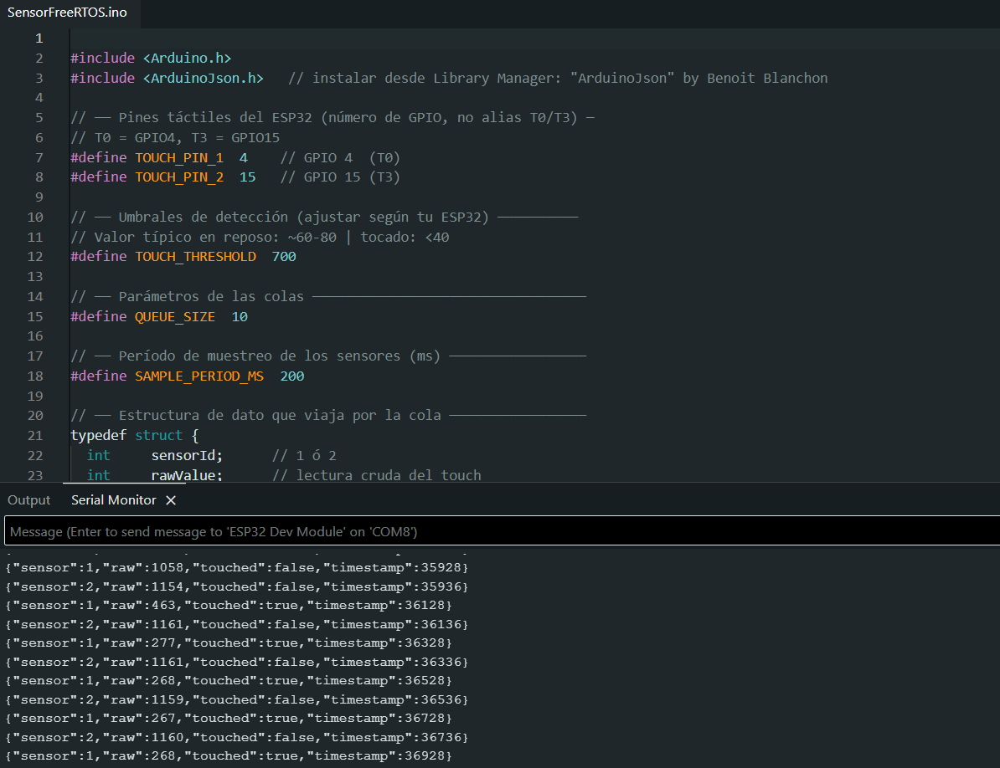

# Laboratorio FreeRTOS

Proyecto académico desarrollado con **ESP32**, **Arduino IDE** y **FreeRTOS** para implementar una **máquina inteligente de reciclaje** capaz de detectar objetos, clasificarlos, registrar eventos y comunicar la información de forma concurrente mediante **tareas**, **colas** y **mutex**.

---

## Integrantes

- Daniel Sanchez Sotelo  
- Jeronimo Infante Vega  
- Juan Camilo Gómez  

---

## Descripción del proyecto

Este proyecto propone el diseño de una **máquina de reciclaje inteligente** orientada a mitigar la contaminación y la acumulación de basura en calles urbanas, ofreciendo a los usuarios una forma práctica de depositar residuos reciclables y recibir incentivos por hacerlo.

La solución busca corregir una problemática frecuente: muchas personas separan residuos en sus hogares, pero no encuentran puntos accesibles, visibles o funcionales para depositarlos. En respuesta a esto, se plantea una máquina automatizada capaz de recibir objetos reciclables, identificarlos, registrarlos y asociarlos a un sistema de recompensas.

Desde el enfoque técnico de la práctica, el sistema se implementa con **FreeRTOS**, dividiendo el funcionamiento en procesos concurrentes organizados por tareas. Estas tareas intercambian información a través de colas y usan mecanismos de sincronización como mutex para proteger recursos compartidos, especialmente la salida serial.

---

## Problemática que resuelve

Colombia genera grandes cantidades de residuos sólidos al año, pero solo una parte reducida entra a procesos formales de reciclaje. Aunque existe conciencia ambiental en parte de la población, el sistema presenta fallas importantes en infraestructura e incentivos.

El problema no está únicamente en la disposición de las personas para reciclar, sino en que:

- no existen suficientes puntos de recolección accesibles,
- muchas personas no saben dónde llevar sus residuos,
- no hay incentivos visibles para reforzar el hábito,
- y el ciudadano no percibe el impacto real de su acción.

La máquina de reciclaje busca cerrar esa brecha entre la intención de reciclar y la posibilidad real de hacerlo.

---

## Idea principal

Desarrollar una **máquina de reciclaje de objetos** capaz de recibir residuos, detectar información del objeto ingresado, registrar los eventos del sistema y comunicar los resultados. Como valor agregado, se plantea un **sistema de recompensas por reciclaje**, de manera que el usuario obtenga puntos canjeables y tenga una motivación tangible para participar.

---

## Hook del proyecto

**Sistema de recompensas por reciclaje:** el usuario deposita materiales reciclables y recibe puntos que luego pueden convertirse en beneficios, descuentos o recompensas, incentivando así hábitos sostenibles.

---

## Usuario objetivo

### B2C
Personas entre 18 y 55 años, residentes en zonas urbanas y periurbanas de Colombia, con acceso a smartphone y con hábitos previos de reciclaje en el hogar. Son usuarios que ya separan residuos, reutilizan empaques y desean reducir su huella ambiental, pero necesitan una alternativa más visible, práctica y útil para entregar esos materiales.

### B2B
Cadenas de supermercados y empresas que deseen implementar modelos de reciclaje dentro de sus procesos de sostenibilidad, fidelización de clientes o economía circular. Entre los posibles aliados se encuentran supermercados como **Éxito, Jumbo, D1, Ara y Carulla**.

---

## ¿Qué falla del sistema busca reparar?

La propuesta busca corregir una falla estructural en el proceso de reciclaje: el ciudadano sí puede estar dispuesto a reciclar, pero el entorno no le facilita hacerlo. En otras palabras, la falla principal no es de conciencia, sino de **infraestructura, seguimiento e incentivos**.

La máquina de reciclaje repara esa falla al:

- crear un punto físico de recolección más accesible,
- registrar lo que el usuario entrega,
- generar información útil sobre reciclaje,
- y recompensar la acción para fortalecer el hábito.

---

## Efecto WOW

La experiencia central del sistema puede resumirse en tres pasos:

1. **Reciclar**  
   El usuario deposita un objeto reciclable en la máquina.

2. **Obtener puntos**  
   El sistema registra la acción y asigna puntos o beneficios asociados.

3. **Redimir recompensas**  
   Los puntos obtenidos pueden convertirse en descuentos, beneficios o incentivos personalizados.

---

## Uso de inteligencia artificial

Como parte de la visión general del proyecto, se plantea el uso de IA para tareas como:

- clasificación de objetos reciclables,
- identificación de patrones de reciclaje de los usuarios,
- generación de recomendaciones o misiones de reciclaje,
- apoyo en chats dirigidos a empresas,
- y posibles sugerencias de consumo responsable.

Para la práctica con FreeRTOS, la implementación se concentra en la parte embebida y concurrente del sistema, mientras que la IA se plantea como una capa futura o complementaria.

---

## ¿Qué tarea sobrehumana haría la IA?

La IA permitiría realizar tareas que serían difíciles de ejecutar manualmente de manera escalable, por ejemplo:

- identificar automáticamente el tipo de objeto ingresado,
- analizar patrones de reciclaje por usuario,
- relacionar hábitos de compra con hábitos de reciclaje,
- y sugerir recompensas o cupones personalizados según el comportamiento detectado.

---

## Fuentes de datos para la IA

Los datos que alimentarían una solución futura con inteligencia artificial provendrían de:

- **fotos o imágenes** de los objetos,
- **sensores** instalados en la máquina,
- **bases de datos** de interacción con usuarios,
- historiales de reciclaje,
- y, en caso de alianzas, información de compras asociadas a programas de fidelización.

---

## Sentidos que usaría la IA

La propuesta de IA utilizaría principalmente:

- **imágenes**
- **datos numéricos**

---

## Mayor desafío técnico

Uno de los principales desafíos técnicos del proyecto es lograr una integración efectiva entre:

- el sistema embebido que opera la máquina,
- la clasificación inteligente de objetos,
- el registro confiable de datos,
- y la asignación correcta del valor o recompensa para cada material reciclado.

---

## Herramientas necesarias

- **ESP32**
- **Arduino IDE**
- **FreeRTOS**
- **C/C++**
- **Draw.io / Diagrams.net**
- **GitHub**
- **Bases de datos** como Supabase o similares
- Herramientas de **IA** para clasificación y recomendación

---

## Impacto social y ambiental

A largo plazo, esta solución puede contribuir a:

- aumentar la cantidad de residuos que entran a procesos de reciclaje,
- reducir la basura acumulada en calles y zonas urbanas,
- fortalecer hábitos sostenibles en los ciudadanos,
- generar ahorro o beneficios para los usuarios,
- y ayudar a empresas a cumplir metas de sostenibilidad mediante datos verificables.

De esta manera, el proyecto no solo atiende una necesidad tecnológica, sino también una problemática ambiental y social.

---

## Objetivo general

Implementar una arquitectura concurrente con FreeRTOS para una máquina inteligente de reciclaje, permitiendo leer sensores o entradas del sistema, procesar información, comunicar eventos en formato JSON y proteger recursos compartidos de forma segura y ordenada.

---

## Objetivos específicos

- Leer datos de distintas entradas del sistema usando tareas independientes.
- Enviar los datos entre tareas mediante colas.
- Proteger recursos compartidos como el puerto serial mediante mutex.
- Registrar los eventos relacionados con los objetos ingresados.
- Mostrar o transmitir los datos del sistema en formato JSON.
- Aplicar conceptos de concurrencia y sincronización en un sistema embebido.
- Plantear la arquitectura de una máquina de reciclaje escalable basada en FreeRTOS.

---

## Funcionamiento general del sistema

Para efectos de la práctica, el sistema se organiza usando tareas concurrentes. Una implementación base puede dividirse de la siguiente forma:

1. **Tarea de lectura de sensor/entrada 1**  
   Detecta un evento asociado al ingreso de un objeto y envía el dato a una cola junto con una marca de tiempo.

2. **Tarea de lectura de sensor/entrada 2**  
   Detecta otro evento del sistema y envía el dato a una segunda cola, también con timestamp.

3. **Tarea de procesamiento o clasificación básica**  
   Recibe la información y determina el estado del objeto o evento registrado.

4. **Tarea de comunicación 1**  
   Lee datos desde una cola y los envía por comunicación serial en formato JSON.

5. **Tarea de comunicación 2**  
   Lee datos desde otra cola y también transmite información en formato JSON.

6. **Protección del puerto serial**  
   Como varias tareas pueden intentar escribir al mismo tiempo, se utiliza un **mutex** para evitar corrupción de datos en la salida.

---

## Relación con las pautas del laboratorio

La práctica solicita implementar un sistema con:

- tareas reutilizando la misma función pero con distintos parámetros,
- colas independientes para el envío de datos,
- timestamps asociados a cada evento,
- salida serial en formato JSON,
- y protección del acceso concurrente al puerto serial.

Este proyecto se adapta a dichos requisitos al modelar la máquina de reciclaje como un sistema concurrente donde diferentes entradas o sensores pueden ser atendidos por tareas similares, cada una con parámetros distintos, mientras los datos se envían y reportan de manera sincronizada.

---

## Arquitectura del sistema

La arquitectura propuesta separa claramente las responsabilidades del sistema:

- **Adquisición de eventos o datos:** sensores, botones, entradas o detección del objeto
- **Comunicación entre procesos:** colas
- **Procesamiento:** clasificación o validación del objeto ingresado
- **Monitoreo:** salida serial JSON
- **Control de concurrencia:** mutex
- **Escalabilidad futura:** integración con IA, base de datos, app móvil y sistema de recompensas

---

## Diagrama del sistema implementado

Aquí va el diagrama correspondiente a la práctica implementada con FreeRTOS.

---

## Diagrama de arquitectura del proyecto

Aquí va el diagrama de arquitectura hipotética de la máquina inteligente de reciclaje.

---

## Diagrama de deadlock

Aquí va el diagrama usado para sustentar el concepto de interbloqueo.

---

## Diagrama de inconsistencia de datos y solución con mutex

Aquí va el diagrama del acceso concurrente sin protección y su solución usando mutex.

---

## Montaje físico

En esta sección se puede mostrar el montaje físico del proyecto.

---

## Evidencia de funcionamiento

Aquí se puede agregar una imagen del monitor serial, pruebas del sistema o validación del funcionamiento.

---

## Preguntas teóricas de la práctica

### ¿Cómo se ejecutan tareas de FreeRTOS con la misma función pero distintos parámetros?

En FreeRTOS, varias tareas pueden crearse utilizando la misma función como punto de entrada. Lo que cambia entre una tarea y otra son los parámetros enviados al momento de crearlas. De este modo, una misma lógica puede reutilizarse para diferentes sensores, entradas o procesos, evitando duplicación de código.

---

### ¿Cuál es el tipo de dato que recibe una tarea de FreeRTOS? ¿Cómo se puede convertir al tipo específico que requiere la lógica de la función?

Las tareas en FreeRTOS reciben un parámetro de tipo `void *`. Esto permite enviar cualquier tipo de dato, pero dentro de la función es necesario hacer un casting al tipo real que la lógica necesita. Así, una tarea puede interpretar correctamente una estructura, entero o configuración específica según el caso.

---

### ¿Qué pasa cuando una cola se llena y una tarea quiere insertar nuevos elementos?

Cuando una cola está llena, una tarea que intenta insertar nuevos datos puede quedar bloqueada durante el tiempo definido de espera. Si no hay espacio disponible dentro de ese tiempo, el envío falla. Esto permite controlar el flujo de información y evitar sobrescribir datos sin control.

---

### ¿Es posible que varias tareas lean y escriban a la misma cola?

Sí. Varias tareas pueden interactuar con una misma cola, ya sea escribiendo o leyendo de ella, siempre que el diseño del sistema lo contemple adecuadamente. FreeRTOS administra internamente el acceso a la cola, pero el programador debe diseñar bien la lógica para evitar pérdida de datos, bloqueos innecesarios o desorden en el procesamiento.

---

### ¿Qué es un deadlock?

Un **deadlock** o interbloqueo ocurre cuando dos o más tareas quedan esperando indefinidamente por recursos que nunca se liberan, porque cada una posee un recurso que la otra necesita. En sistemas concurrentes esto puede detener parcial o totalmente la ejecución del programa.

Para evitarlo, se recomienda:

- adquirir recursos siempre en el mismo orden,
- reducir el tiempo en que una tarea mantiene bloqueado un recurso,
- usar timeouts,
- y diseñar una estrategia clara de sincronización.

---

### Ejemplo de inconsistencia de datos sin mutex

Cuando dos tareas acceden al mismo recurso compartido sin protección, pueden generarse inconsistencias. Un caso típico es el puerto serial: si dos tareas escriben al mismo tiempo, los mensajes pueden mezclarse y producir una salida corrupta o incomprensible.

La solución consiste en usar un **mutex**, de forma que solo una tarea a la vez pueda acceder al recurso compartido. Así se garantiza integridad en la comunicación y un comportamiento más predecible del sistema.

---

## Conclusión

El proyecto de máquina inteligente de reciclaje representa una propuesta tecnológica con potencial social y ambiental, al facilitar el reciclaje y reforzarlo mediante incentivos. Desde la perspectiva académica, también constituye una aplicación clara de los conceptos principales de FreeRTOS, como tareas, colas, reutilización de funciones y mutex.

Además de resolver una necesidad concreta en términos de automatización y concurrencia, la propuesta permite proyectar una solución más amplia e innovadora, integrando elementos de inteligencia artificial, sistemas de recompensas y recolección de datos para fomentar hábitos sostenibles en la población.
