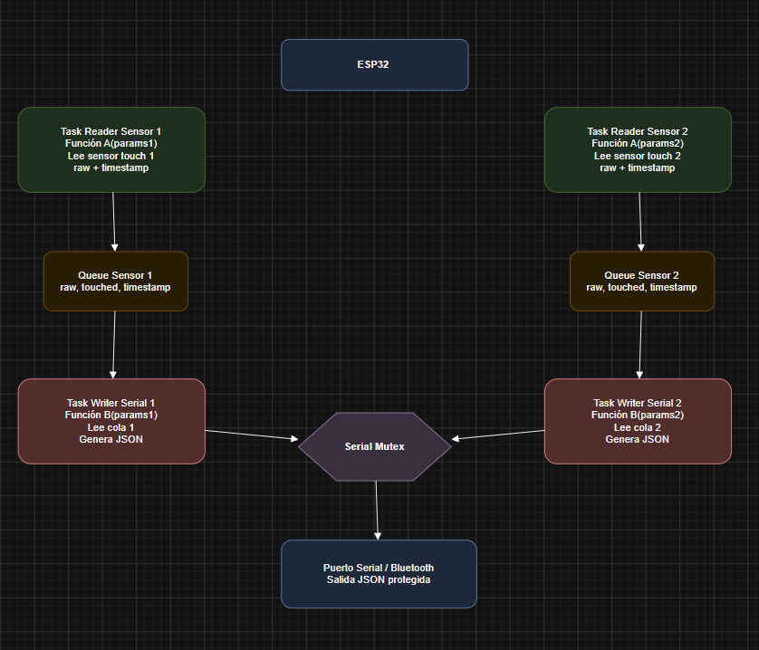
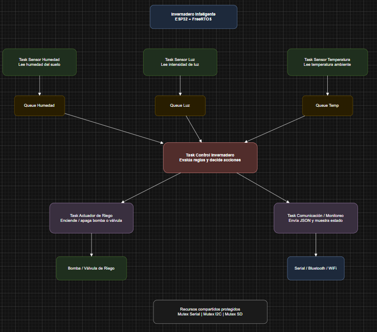
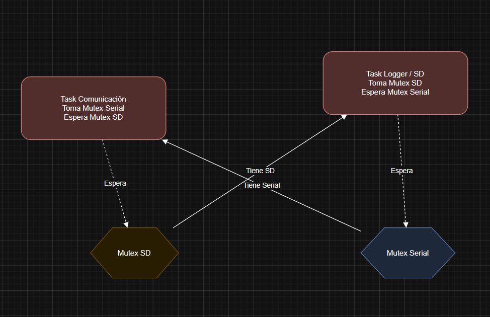
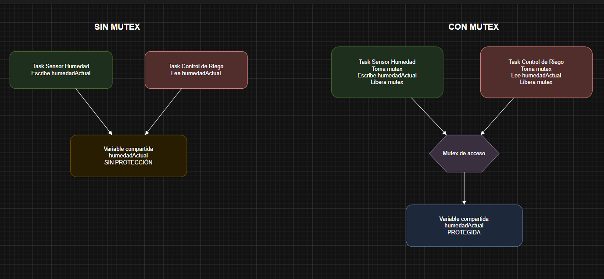
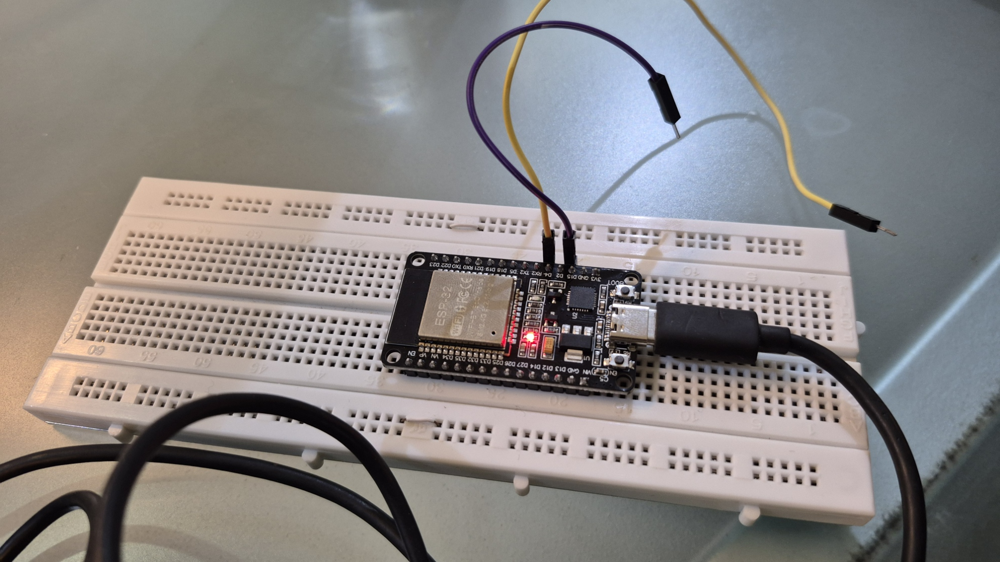

# Invernadero Inteligente con FreeRTOS

Proyecto académico desarrollado con **ESP32**, **Arduino IDE** y **FreeRTOS** para automatizar y monitorear un invernadero mediante una arquitectura concurrente basada en **tareas**, **colas** y **mutex**.

---

## Integrantes

- Daniel Sanchez Sotelo    
- Jeronimo Infante Vega
- Juan Camilo Gómez

---

## Descripción del proyecto

Este proyecto propone el diseño e implementación de un **invernadero inteligente** usando los principales elementos de FreeRTOS. El sistema se encarga de leer variables importantes del entorno y reaccionar ante ellas de manera organizada y concurrente.

El invernadero cuenta con los siguientes elementos principales:

- **Sensor de humedad**
- **Sensor de luz**
- **Sensor de temperatura**
- **Actuador de riego** que responde al valor de humedad
- **Comunicación serial** para monitoreo de datos en formato JSON

La idea principal es dividir el sistema en procesos independientes que se ejecutan como tareas, comunicar esos procesos mediante colas y proteger los recursos compartidos mediante mutex.

---

## Objetivo general

Implementar una arquitectura concurrente con FreeRTOS para un invernadero inteligente, permitiendo leer sensores, procesar información, tomar decisiones de control y reportar el estado del sistema de forma segura y ordenada.

---

## Objetivos específicos

- Leer datos de varios sensores usando tareas independientes.
- Enviar los datos entre tareas usando colas.
- Proteger recursos compartidos como el puerto serial con mutex.
- Activar un actuador de riego cuando la humedad esté por debajo de un umbral.
- Mostrar o transmitir los datos del sistema en formato JSON.
- Aplicar conceptos de concurrencia y sincronización en un sistema embebido.

---

## Tecnologías y herramientas utilizadas

- **ESP32**
- **Arduino IDE**
- **FreeRTOS**
- **C/C++**
- **Draw.io / Diagrams.net**
- **GitHub**

---

## Funcionamiento general del sistema

El sistema del invernadero está organizado en varias tareas:

1. **Tarea de lectura de humedad**  
   Lee el sensor de humedad y envía el valor a una cola.

2. **Tarea de lectura de luz**  
   Lee el sensor de luz y envía el valor a una cola.

3. **Tarea de lectura de temperatura**  
   Lee el sensor de temperatura y envía el valor a una cola.

4. **Tarea de control**  
   Recibe y analiza los datos. Si la humedad está por debajo del umbral definido, activa el sistema de riego.

5. **Tarea de comunicación**  
   Envía el estado del sistema por el puerto serial en formato JSON.

6. **Protección del puerto serial**  
   Como varias tareas podrían querer escribir en el mismo recurso, se usa un **mutex** para evitar acceso concurrente.

---

## Arquitectura del sistema

La arquitectura se basa en una separación clara de responsabilidades:

- **Adquisición de datos:** sensores
- **Comunicación entre procesos:** colas
- **Procesamiento y toma de decisiones:** tarea de control
- **Actuación:** sistema de riego
- **Monitoreo:** salida serial JSON
- **Control de concurrencia:** mutex

---

## Diagrama del sistema implementado

Aquí va el diagrama correspondiente a la práctica implementada con FreeRTOS.

---

## Diagrama de arquitectura del proyecto

Aquí va el diagrama de arquitectura hipotética del invernadero inteligente.

---

## Diagrama de deadlock

Aquí va el diagrama usado para sustentar el concepto de interbloqueo.

---

## Diagrama de inconsistencia de datos y solución con mutex

Aquí va el diagrama del acceso concurrente sin protección y su solución usando mutex.

---

## Montaje físico

En esta sección se puede mostrar el montaje físico del proyecto.

---

## Evidencia de funcionamiento

Aquí se puede agregar una imagen del monitor serial, pruebas del sistema o validación del funcionamiento.

